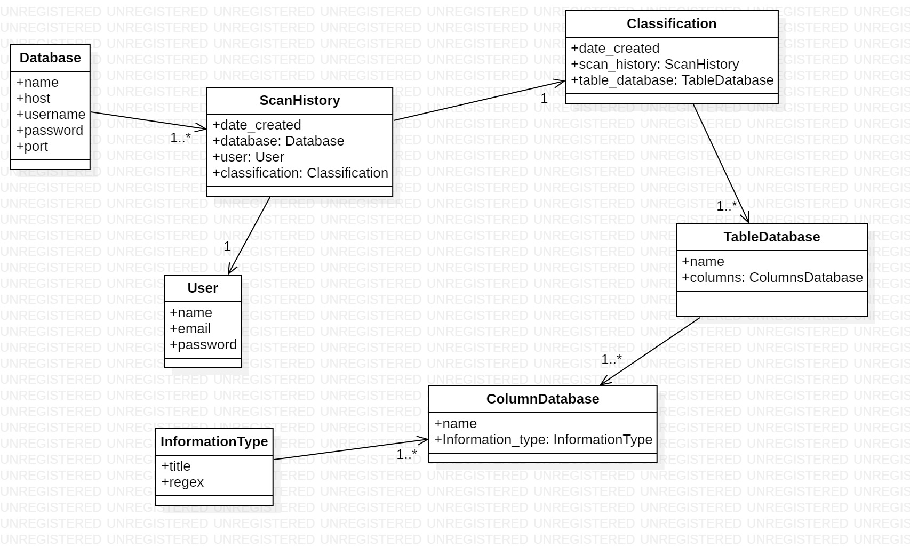

# Challenge - Data security - Mercado Libre

## Levantar el proyecto
Para levantar el siguiente proyecto debe tener instalado en su maquina **Docker**, en el siguiente [link](https://docs.docker.com/engine/install/) podrán instalarlo. Con un solo comando la aplicacion ya correra completamente, levantara la api, la base de datos de la app y la base de datos de prueba. Posteriormente cargara la base de datos de la aplicacion con las tablas pertinentes, al igual que en la base de datos de prueba.

Una vez clonado el repositorio, deberá ejecutar el siguiente comando:

```
docker compose up
```

La API cuenta con los siguientes endpoints:

| POST | GET|
| --- | --- |
| /api/v1/database | /api/v1/database/scan/:id |
| /api/v1/database/scan/:id |

El primer enpoint **POST /api/v1/database/**, consiste en permitir la persistencia de datos de conexiones a otras bases de datos, que posteriormente podran ser escaneadas.

El segundo endpoint **POST /api/v1/database/scan/:id** es para ejecutar la clasificacion de la de una base de datos, dicho **id** que se la pasa por paramentro corresponde a una conexion de una base de datos.

El tercer endpoint **GET /api/v1/database/scan/:id** es para obtener la clasificacion de una base de datos, con sus tablas, columnas y el tipo de informacion identificada para cada columna.


## Diagrama de clases




## Tecnologias Utilizadas

- **Django Rest Framework**: es un marco de desarrollo para construir API en aplicaciones web utilizando el framework de Python llamado Django.

- **MySql**: Motor de base de datos relacional para dar persistencia de datos a los datos de la app.

- **Docker y docker compose**: Para crear la imagen de la Api desarrollada. Y en conjunto use su plugin docker compose para levantar y conectar los contedores de la aplicación, y las diferentes bases de datos requeridas y orquestarlas..

- **Swagger**: es una herramienta de especificaciones que utilice para definir la APIs de manera estandarizada y comprensible. Proporciona una forma de describir la estructura de una API, los endpoints, los parámetros de entrada, los tipos de respuesta, los métodos HTTP admitidos y otra información relevante en un formato legible.

### Recomendacion

Dentro de la **/api/docs/** podra ver la documentacion de todos los endpoint de la API.

### Entregables
- [Dockerfile correspondiente para ejecutar la aplicación](Dockerfile)
- [Script SQL para crear la base de datos de la aplicación](./app/scripts/db_app.sql)
- [Script SQL para crear una base de datos de ejemplo a escanear](./app/scripts/db_prueba.sql)
- [Documentación de la estrategia y solución](README)

## Bonus realizados
- Logging.
- Testing.
- Autenticación en la api.
